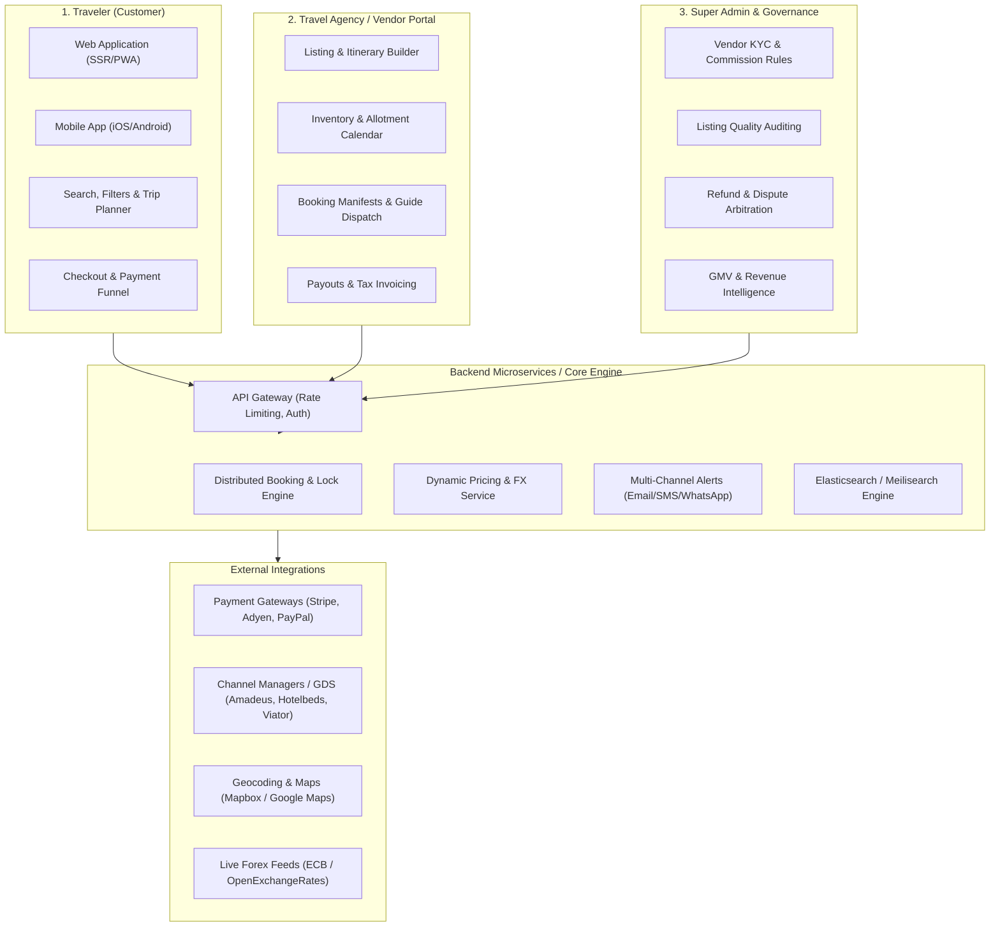
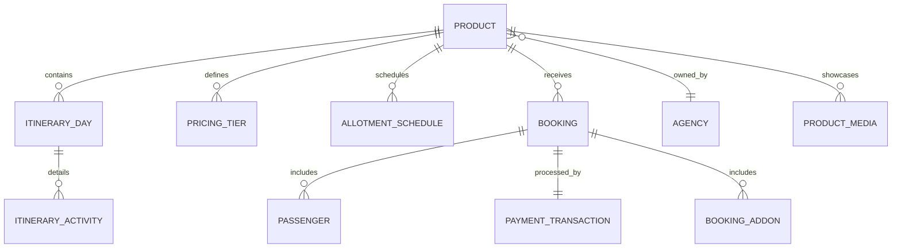
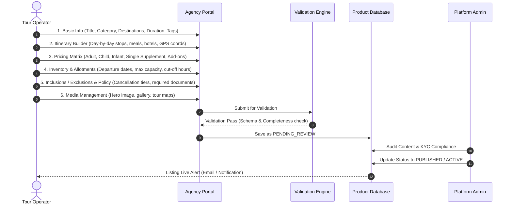
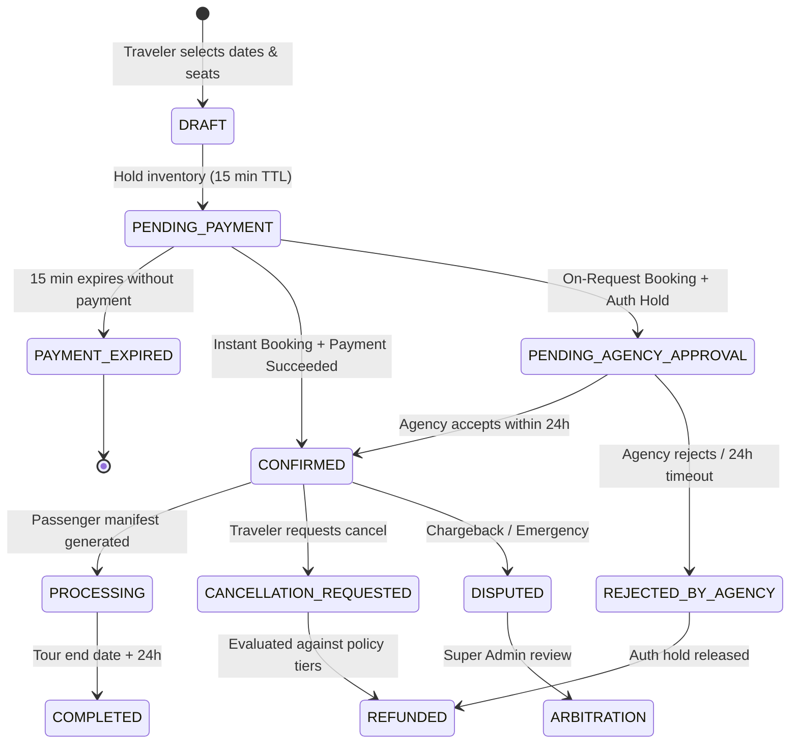
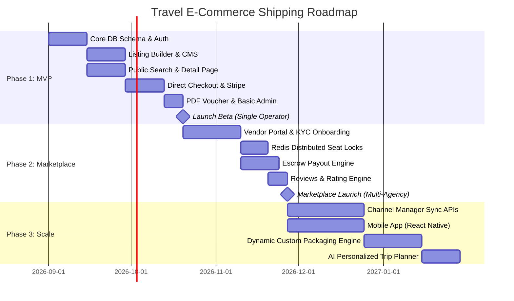

# Travel Agency E-Commerce Ecosystem: Comprehensive Technical & Product Blueprint

An end-to-end architecture, product specification, and operational guide for building and shipping a production-ready, scalable Travel Agency & Tour Operator E-Commerce Platform.

---

## 1. Executive Architecture & Ecosystem Overview

Modern travel e-commerce platforms operate either as a **Direct Agency Model** (single operator selling its own packages/accommodations) or a **Multi-Vendor Marketplace / OTA Model** (connecting travelers with independent tour operators, DMCs, and hotels). This blueprint covers the full multi-tenant marketplace ecosystem, which scales seamlessly to both models.

---

## 2. Platform Roles & Persona Specifications

### 2.1 Traveler (B2C Customer)
* **Goal**: Seamless discovery, transparent pricing, customized itineraries, trusted reviews, and zero-friction booking with instant confirmation.
* **Core Capabilities**:
  * Multi-dimensional search (Destination, Dates, Budget, Category, Group Size, Activity Level).
  * Interactive day-by-day itineraries with route maps, inclusions/exclusions, and media galleries.
  * Real-time seat/room availability checking.
  * Split payments, deposits, installment plans, and multi-currency checkout.
  * Self-service booking management (PDF voucher downloads, offline QR passes, cancellation requests, rescheduling).
  * Post-trip reviews, photo uploads, and loyalty/points management.

### 2.2 Agency / Tour Operator / DMC (B2B Vendor)
* **Goal**: Maximize bookings, streamline inventory/allotment management, eliminate double-bookings, and automate passenger manifests and payouts.
* **Core Capabilities**:
  * Multi-step Listing Creation with dynamic itineraries, pricing tiers, and blackout calendars.
  * Capacity & allotment rules (Instant Confirmation vs. On-Request / Manual Approval).
  * Passenger manifest generation (export to PDF/Excel for guides, drivers, and hotels).
  * Dynamic pricing rules (Early Bird, Last Minute, Weekend surge, High/Low season).
  * Direct customer messaging for itinerary clarifications, pickup coordination, and emergency alerts.
  * Financial reporting (Net earnings after platform commission, withdrawal requests, tax receipts).

### 2.3 Super Admin / Platform Owner
* **Goal**: Marketplace health, vendor compliance, transaction security, dispute resolution, and revenue optimization.
* **Core Capabilities**:
  * Vendor onboarding & KYC approval (business license, insurance verification, bank account checks).
  * Listing audit pipeline (content compliance, copyright checks, SEO standards).
  * Commission configuration (Global platform fee, category-specific rates, vendor tier discounts).
  * Escrow & settlement engine (holding funds until tour completion to mitigate chargebacks and cancellations).
  * Full audit trail on bookings, payments, refunds, and promo code abuse.

---

## 3. Product Catalog & Listing Architecture

Travel products have **temporal availability**, **seat/occupancy limits**, **complex pricing matrices**, and **strict logistics**.

### 3.1 Types of Travel Products Supported
1. **Multi-Day Guided Tours**: Fixed start/end dates, day-by-day routes, scheduled meals, designated accommodations, transport included.
2. **Day Tours & Excursions**: Hourly time slots (e.g., 09:00 AM, 02:00 PM), maximum pax per slot, multi-language guide options.
3. **Accommodations & Stays**: Check-in/check-out dates, room categories, bed configurations, board basis (Room Only, B&B, Half Board, All Inclusive).
4. **Transport & Transfers**: Airport pickups, chartered vans, ferry transfers with flight number tracking.
5. **Custom Dynamic Packages**: Traveler selects flight + hotel + 3 activities in a single unified cart checkout.

### 3.2 Step-by-Step Listing Creation Flow

---

## 4. Populating & Ingesting Travel Listings at Scale

| Ingestion Method | Target Use Case | Technical Implementation |
| :--- | :--- | :--- |
| **Manual Stepper CMS** | Independent boutique tour operators and local guides | Multi-step form with draft autosave, rich text editor, drag-and-drop itinerary reordering, and map picker. |
| **Bulk CSV / XLSX Import** | Agencies migrating 50+ existing packages | Async background parser (BullMQ / Celery) with schema validation, error row reporting, and asset URL scraping. |
| **Channel Managers & GDS APIs** | Large hotel chains, enterprise operators, OTAs | Real-time bi-directional XML/JSON sync (e.g., Hotelbeds, Amadeus, Viator API, Beds24, PaxFlow). |
| **AI-Assisted Listing Generator** | Quick drafting for operators with raw brochures | LLM pipeline that extracts day-by-day itineraries, highlights, and inclusions from uploaded PDFs or brochures into structured JSON. |

---

## 5. End-to-End Feature Matrix

| Traveler (B2C) | Agency (B2B) | Admin (Super) |
| :--- | :--- | :--- |
| Multi-facet Elastic Search | Multi-step Listing Builder | Vendor KYC & Vetting |
| Dynamic Date/Seat Selector | Real-time Calendar Grid | Commission Rules Engine |
| Interactive Day-by-Day Maps | Booking Approvals / Rejections | Global Dispute Arbitration Hub |
| Tiered Pricing Breakdown | Passenger Manifests (PDF / XLSX) | Dynamic FX & Multi-Tax Engine |
| Deposit & Split Checkout | Guide Assignment & Dispatch | Listing Quality Audit Queue |
| Multi-Currency Conversion | Sub-agent Staff Permissions | Payment Escrow Management |
| PDF Vouchers & Apple Wallet QR | Earnings & Payout Requests | Platform Revenue Analytics |
| Self-service Cancellation | Direct Traveler Messaging | Webhooks & Integration Logs |
| Verified Review & Rating Engine | Blackout & Stop-Sell Alerts | Promo, Coupon & Affiliate Hub |

---

## 6. Critical Technical & Operational Considerations

### 6.1 Inventory Concurrency & Race Conditions (Double-Booking Prevention)
* **The Problem**: Two travelers attempt to book the last 2 seats on a high-demand Santorini sunset cruise simultaneously.
* **The Solution**: **Distributed 2-Phase Locking with Redis**.
  1. When a user enters the checkout step, acquire a Redis distributed lock (`SET tour:{id}:date:{date} NX EX 900`).
  2. Reserve the seats temporarily for **15 minutes**.
  3. If payment succeeds, decrement database allotment permanently and release lock.
  4. If payment fails or session expires, automatically release the hold back into the public inventory pool.

### 6.2 Multi-Currency & Real-Time Forex Hedging
* **The Problem**: A traveler books in EUR, the agency is based in Japan and gets paid in JPY, and platform accounting runs in USD.
* **Architecture**:
  * Store all base transaction amounts in the system default currency (e.g., USD) using integer cents/micros (e.g., `$150.00` = `15000`).
  * Fetch live exchange rates hourly from central bank feeds (ECB / OpenExchangeRates) with a configurable safety buffer (e.g., +1.5% to absorb intraday FX swings).
  * Display prices localized to the traveler's IP/preference, lock the exchange rate for the checkout duration, and settle to the agency in their requested payout currency.

### 6.3 Booking State Machine & Lifecycle

### 6.4 Cancellation Policy Engine
Implement automated, tier-based refund calculations:
* **Tier 1 (Flexible)**: 100% refund up to 72 hours before departure.
* **Tier 2 (Moderate)**: 100% refund up to 14 days before; 50% refund up to 7 days before; 0% thereafter.
* **Tier 3 (Strict / Non-Refundable)**: 0% refund once confirmed (typically for chartered flights or high-season hotel buyouts).
* Support **Voucher Credit Option**: Offer 110% refund value as a platform credit wallet to prevent cash outflow.

### 6.5 Escrow Settlement & Payout Engine
* **Crucial Travel Rule**: **Never payout vendors immediately upon booking.**
* If a tour is scheduled 6 months in advance and the operator cancels or defaults, the platform is liable for chargebacks.
* **Standard Escrow Pattern**:
  * Collect 100% from traveler at booking.
  * Hold funds in platform escrow.
  * Release payment to vendor **24–48 hours after the tour has successfully concluded**, minus platform commission.

---

## 7. Compliance, Security & Regulatory Standards

| Standard / Regulation | Requirement | Technical Implementation |
| :--- | :--- | :--- |
| **PCI-DSS Level 1** | Payment Card Security | Never touch, transmit, or store raw credit card numbers. Use hosted fields (Stripe Elements / Adyen Drop-in) for tokenized payment capture. |
| **GDPR / CCPA** | Data Privacy & Protection | Traveler passport numbers, birthdates, and medical notes must be encrypted at rest (AES-256) with strict RBAC. Provide self-service data export and deletion. |
| **Package Travel Directive (PTD)** | Consumer Insolvency Protection | In EU/UK/CA, selling multi-element packages triggers strict consumer insolvency protection and bonded financial trust requirements (ATOL / ABTA / TICO). |
| **Multi-Jurisdiction VAT / GST** | Tax Invoicing & Settlement | Digital services vs. Tour Operator Margin Schemes (TOMS). Automated invoicing with explicit tax breakdown per legal entity. |

---

## 8. Industry Do's and Don'ts

### Architectural & Engineering

| DO | DON'T |
| :--- | :--- |
| **DO** use integer/atomic values for currency (e.g. cents) to prevent floating-point precision loss. | **DON'T** use `FLOAT` or `DOUBLE` for monetary calculations. |
| **DO** store all schedule dates with strict UTC offsets + local timezone of the destination. | **DON'T** rely on server local time for departure schedules. |
| **DO** implement distributed locks with Redis for checkout reservation holds. | **DON'T** allow checkout without an atomic inventory lock (causes double bookings). |
| **DO** implement asynchronous queue workers (BullMQ/RabbitMQ) for heavy PDF generation, email blasts, and third-party API syncs. | **DON'T** generate passenger manifests or large PDF tickets synchronously inside the HTTP request loop. |

### Product & User Experience

| DO | DON'T |
| :--- | :--- |
| **DO** display transparent total pricing with taxes and mandatory local fees clearly itemized before checkout. | **DON'T** surprise travelers with unexpected hidden booking fees on the final payment screen. |
| **DO** generate instant Apple Wallet / Google Wallet passes and offline printable PDF vouchers with QR codes. | **DON'T** force travelers to rely on active mobile data connection at remote travel destinations. |
| **DO** collect passport details asynchronously post-booking if departure is far in advance to reduce checkout drop-off. | **DON'T** put a 20-field passenger form in front of the payment button. |
| **DO** provide clear cancellation countdown timers (e.g. "Free cancellation until June 12, 11:59 PM"). | **DON'T** use ambiguous cancellation terms like "Standard policies apply". |

### Marketplace & Business Operations

| DO | DON'T |
| :--- | :--- |
| **DO** hold vendor payouts in escrow until 24-48 hours after tour completion. | **DON'T** release 100% upfront funds to unvetted vendors upon booking. |
| **DO** mandate identity verification (KYC), business license, and liability insurance for all operators. | **DON'T** allow open, unverified public self-publishing of tours. |
| **DO** enforce an SLA timer (e.g., 24 hours) for on-request bookings with automatic fallback cancellation. | **DON'T** leave customer bookings hanging indefinitely waiting for agency manual response. |

---

## 9. Recommended Technology Stack

| Layer | Recommended Technologies | Purpose & Architecture Fit |
| :--- | :--- | :--- |
| **Frontend (Web)** | Next.js (App Router, React 19, TypeScript), Tailwind CSS, Framer Motion, Mapbox GL | Server-Side Rendering for SEO, sub-second route transitions, interactive maps |
| **Mobile App** | React Native / Expo | Native iOS & Android apps sharing API types and business logic with web |
| **Backend APIs** | Node.js (NestJS / Fastify) or Go (Golang) | High-throughput REST and GraphQL / tRPC booking endpoints |
| **Primary Database** | PostgreSQL 16 (JSONB, PostGIS) | ACID transactions for bookings, relational integrity, spatial destination queries |
| **Cache & Distributed Locks** | Redis (Cluster / Dragonfly) | Distributed 15-minute seat reservation holds, rate limiting, session store |
| **Search Engine** | Meilisearch or Elasticsearch | Typo-tolerant, sub-50ms faceted travel destination search |
| **Queue & Background Jobs** | BullMQ (Redis-backed) or AWS SQS + Celery | Async PDF voucher rendering, email/SMS dispatch, channel manager sync |
| **Media Storage & CDN** | Cloudflare R2 / AWS S3 + Cloudflare Images / Imgix | Edge-cached WebP/AVIF images, adaptive mobile resizing |
| **Payments & Settlements** | Stripe Connect (Custom/Express) / Adyen for Platforms | Multi-currency split payments, vendor escrow, automated bank payouts |
| **Communications** | Resend / SendGrid (Email) + Twilio (SMS/WhatsApp) | Booking confirmations with `.ics` calendar attachments, departure alerts |
| **Observability** | OpenTelemetry, Datadog / Grafana, Sentry | Real-time APM, transaction tracing, and error monitoring |

---

## 10. Phased Roadmap to Shipping

---

*Authored for production-grade engineering and operational excellence.*
